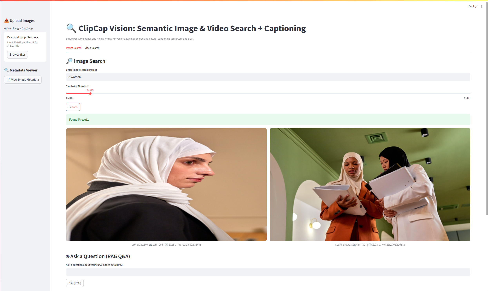
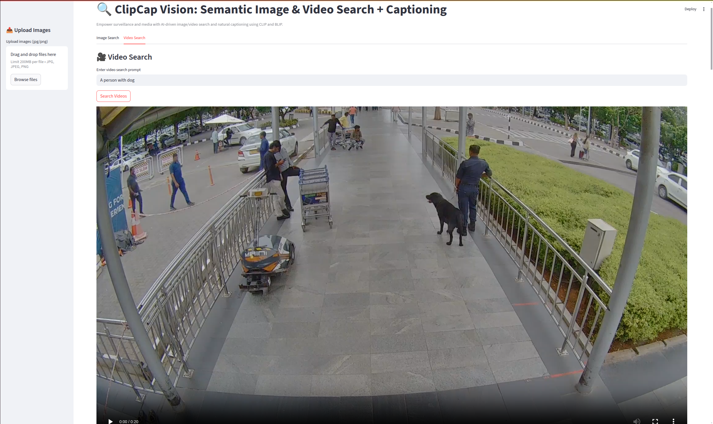
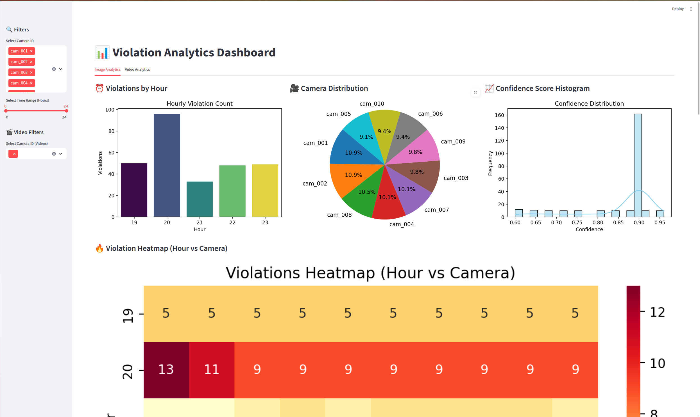
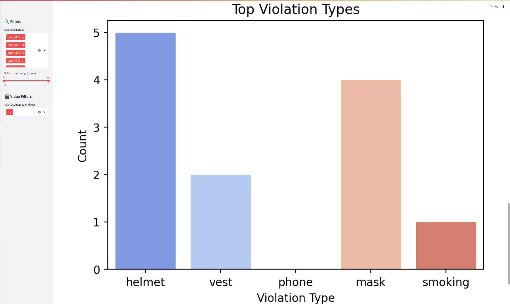
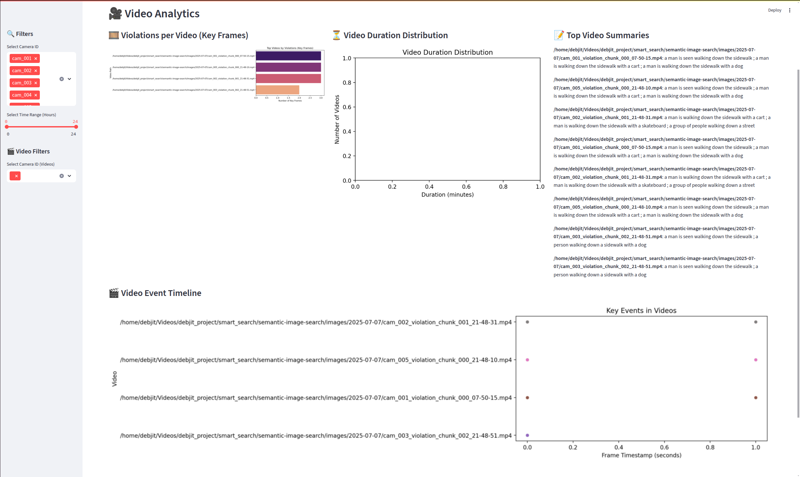

🔎 ClipCap Vision: Semantic Image & Video Search + Captioning
AI-powered, real-time search and analytics for surveillance, media, and enterprise.
Find, caption, and analyze both images and videos using CLIP+LoRA, BLIP, and a modern RAG Q&A pipeline.

🚀 Features
Multi-Modal Semantic Search

Natural language queries for both images and videos
Example:
no helmet in last 10 minutes from camera_1
person with a dog
show me video of a man in a red shirt
Real-Time Ingestion & Indexing

Auto-monitors folders for new images and videos
Extracts frames from videos, tags with CLIP/LoRA + BLIP
RAG Q&A (Retrieval-Augmented Generation)

Ask questions about your data (images or videos)
Centralized, context-aware answers (not just search)
Live Analytics Dashboard

Hourly trends, camera-wise distribution, confidence histograms
Video analytics: violations per video, duration, event timeline
Modern Streamlit UI

Tabs for image and video search
Upload, search, caption, and analytics in one place
Production-Ready Pipeline

ChromaDB for fast, scalable vector search
SQLite for metadata/analytics
Docker support for easy deployment

## 🖼️ Screenshots

### Image Search

### Video Search

### Analytics Dashboard

### Top Violation Types

### Video Event Timeline

🧭 Project Structure
semantic-image-search/
├── app/
│   ├── main_app.py           # Streamlit UI (image/video search, Q&A)
│   ├── observer.py           # Real-time file/video watcher
│   ├── video_chunker.py      # Frame extraction + video metadata
│   ├── frame_tagger.py       # Frame tagging (CLIP/LoRA + BLIP)
│   ├── database.py           # SQLite metadata manager
│   ├── analytics_dashboard.py # Analytics dashboard
│   └── utils.py              # Embedding, captioning, helpers
│
├── scripts/                  # CLI tools for dev/test
│   ├── dummy_image_violation_generator.py
│   ├── dummy_video_violation_generator.py
│   └── video_splitter.py
│
├── data/
│   ├── cache/
│   └── metadata.db
├── images/                   # Indexed images/videos
├── frames/                   # Extracted video frames
├── video_chunks/             # Video chunks for testing
├── doc/                      # README assets, screenshots, etc.
└── requirements.txt
🛠️ Getting Started
# 1. Clone the repository
git clone https://github.com/debjit721212/semantic-image-search.git
cd semantic-image-search

# 2. (Optional) Setup virtual environment
python3 -m venv env
source env/bin/activate

# 3. Install dependencies
pip install -r requirements.txt

# 4. Launch the Streamlit app
streamlit run app/main_app.py

🐳 Docker Support
# Build image
docker build -t clipcap-vision .

# Run the app
docker run -p 8501:8501 -v $(pwd)/images:/app/images clipcap-vision

# Or use docker-compose (if needed)
docker-compose up --build

# Stop it
docker-compose down

📊 Live Analytics Dashboard
Filter by camera ID or hours
Hourly violation bar chart
Camera usage pie chart
Confidence histogram
Video analytics: violations per video, duration, event timeline
Full metadata table
🤖 How It Works
Images and videos are ingested in real time.
Videos are split into frames, each frame is tagged and indexed.
All embeddings and captions are stored in ChromaDB for fast semantic search.
Metadata is stored in SQLite for analytics and reporting.
RAG Q&A lets you ask questions about your data and get context-aware answers.
Streamlit UI provides a modern, user-friendly interface for search, upload, and analytics.
🧪 Future Enhancements
✅ REST API for remote querying
✅ Docker + deployment automation
🔲 Multi-modal alert system
🔲 Replace SQLite with Qdrant or Weaviate
🔲 Live camera stream captioning
🔲 Video event summarization with LLMs
🙌 Acknowledgements
OpenAI CLIP
Salesforce BLIP
Streamlit
ChromaDB
SQLite
Docker
📜 License
MIT License — See LICENSE

Built with ❤️ by @debjit721212

💡 Why This Project?
Solves real-world surveillance and media search problems
Handles both images and videos, with RAG Q&A
Production-ready, scalable, and open source
Modern, modular, and easy to extend
Try it, contribute, and make AI-powered vision search better for everyone!